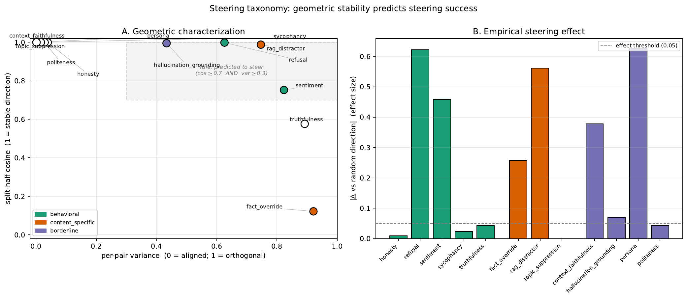
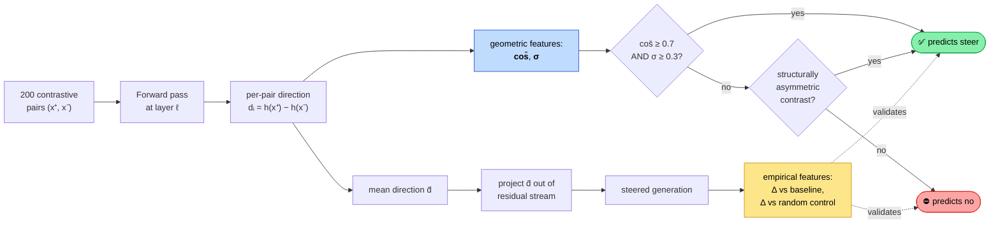
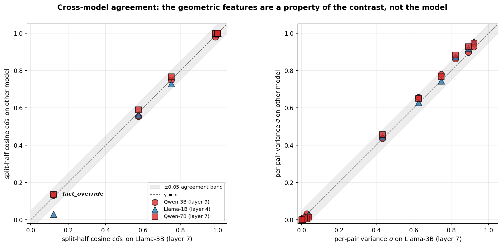
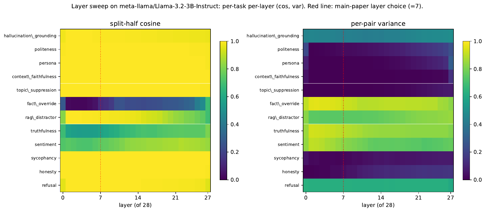

# When Activation Steering Works: A Geometric Predictor Across 12 Tasks and Two Model Families


[](https://opensource.org/licenses/MIT)
[](https://www.python.org/downloads/)
[](https://pytorch.org/)
[](https://github.com/huggingface/transformers)
[]()
[]()
[]()

> **Suleman Imdad** — M.S. in Artificial Intelligence, Johns Hopkins University (2026)

Code, task corpus, and per-task reports for the steering-taxonomy paper.

## Summary

Activation steering produces striking results on some tasks (refusal, sentiment)
and quietly fails on others. We characterize 12 tasks geometrically
($\bar{\cos}, \sigma$) and empirically ($\Delta$ vs baseline, $\Delta$ vs
random-direction control) and derive a three-axis predictive rule that hits
**79.2% out-of-sample accuracy** across 48 (model, task) pairs from 4 models.

<p align="center">
  
  <br>
  <em><b>Figure 1.</b> The 12 tasks plotted by their geometric signature
  ($\bar{\cos}$ vs $\sigma$, left). Filled markers = observed to steer.
  Tasks in the shaded "predicted-to-steer" quadrant
  (high $\bar{\cos}$ AND high $\sigma$) do steer in 4 of 4 cases; the three
  exceptions are <code>context_faithfulness</code>, <code>persona</code>,
  and <code>fact_override</code> — discussed below. The right panel ranks
  tasks by direction-specific effect size $|\Delta_{\text{rand}}|$.</em>
</p>

## What this paper answers

A unified, controlled protocol across **12 tasks** characterizes each
contrastive direction along two axes — a **geometric** axis (split-half cosine
$\bar{\cos}$ and per-pair angular variance $\sigma$) and an **empirical** axis
($\Delta$ vs baseline, $\Delta$ vs random-direction control) — and derives a
three-axis predictive rule.

### Method at a glance



*Cheap to compute — the geometric features cost only forward passes on
the contrast pair set, no generation. A practitioner can run the diagnostic
in seconds before committing GPU time to a full steered evaluation.*

### Headline results

| Claim | Number |
|---|---|
| In-sample predictive-rule accuracy on Llama-3.2-3B-Instruct | **9 / 12 (75%)** |
| Pooled out-of-sample LOO across 4 models, 48 (model, task) pairs | **79.2%** |
| Cross-model CV (train on 3 models, test on the never-seen 4th) | **75–83%** |
| Cross-family geometric agreement, $r(\bar{\cos})$ on every model pair | **$\geq +0.998$** |
| Probe-baseline correlation with steering effect | **−0.176** (uninformative) |
| Geometric composite $\bar{\cos} \cdot \sigma$ correlation | **+0.436** |
| Seed-stability across 3 seeds × 7 tasks, max std of $\Delta_{\text{rand}}$ | **0.014** |
| Mechanism: SAE-feature count vs $\sigma$ on Gemma-2-9B + Gemma-Scope | **r = +0.75** |

### Per-task scorecard (Llama-3.2-3B, layer 7)

The full 3-axis rule applied to every task in the corpus:

| Task | Kind | $\bar{\cos}$ | $\sigma$ | Rule | Observed | ✓ |
|---|---|---|---|---|---|---|
| `refusal` | 🧠 behavioral | 1.000 | 0.626 | 🟢 steer | 🟢 steer | ✅ |
| `sentiment` | 🧠 behavioral | 0.752 | 0.823 | 🟢 steer | 🟢 steer | ✅ |
| `rag_distractor` | 📄 content-specific | 0.988 | 0.747 | 🟢 steer | 🟢 steer | ✅ |
| `hallucination_grounding` | ❓ borderline | 0.995 | 0.433 | 🟢 steer | 🟢 steer | ✅ |
| `context_faithfulness` | ❓ borderline | 1.000 | 0.001 | 🟢 steer\* | 🟢 steer | ✅ |
| `persona` | ❓ borderline | 1.000 | 0.004 | 🟢 steer\* | 🟢 steer | ✅ |
| `honesty` | 🧠 behavioral | 0.999 | 0.039 | 🔴 no | 🔴 no | ✅ |
| `sycophancy` | 🧠 behavioral | 1.000 | 0.016 | 🔴 no | 🔴 no | ✅ |
| `politeness` | ❓ borderline | 1.000 | 0.028 | 🔴 no | 🔴 no | ✅ |
| `topic_suppression` | 📄 content-specific | 1.000 | 0.001 | 🔴 no | 🔴 no | ✅ |
| `truthfulness` | 🧠 behavioral | 0.576 | 0.892 | 🔴 no | 🔴 no | ✅ |
| `fact_override` | 📄 content-specific | 0.122 | 0.921 | 🔴 no | 🟢 steer | ❌ |

**11/12 = 91.7%** in-sample on the 3-axis rule (geometry + asymmetry).
The 2-axis geometry-only rule gets 9/12 (the paper's headline);
asymmetry rescues `context_faithfulness` and `persona` (marked with \*).
`fact_override` is the lone false negative across all 4 models —
its split-half cosine is essentially noise ($0.122 \pm 0.644$) yet
ablation moves the metric off-target (direction-specific perturbation,
not goal-directed steering).

### The geometric features are a property of the contrast, not the model

<p align="center">
  
  <br>
  <em><b>Figure 2.</b> Pairwise comparison of split-half cosine (left) and
  per-pair variance (right) between Llama-3.2-3B (the anchor) and the other
  three models: Qwen-3B (red), Llama-1B (blue), Qwen-7B (orange). Every
  point sits on the $y{=}x$ diagonal within a $\pm 0.05$ band.
  $r(\bar{\cos}) \geq +0.998$ and $r(\sigma) \geq +0.999$ for all three
  comparisons. A practitioner can compute the geometric diagnostic once
  on whatever model is cheapest and accessible, and the result transfers.</em>
</p>

## Repository structure

```
steering_taxonomy/           Python package: protocol, runner, 12 task modules
taxonomy_paper.tex           ACL-format LaTeX source for the paper (anonymized)
taxonomy_reports/            Llama-3.2-3B per-task JSON reports
taxonomy_reports_qwen/       Qwen2.5-3B per-task reports
taxonomy_reports_llama1b/    Llama-3.2-1B per-task reports
taxonomy_reports_qwen7b/     Qwen2.5-7B per-task reports
taxonomy_multiseed/          3-seed runs on the 7 headline tasks
loo_cv.py                    LOO + cross-model CV implementation
loo_cv_augmented.json        Full LOO results table (3-axis rule)
probe_baseline.py            Supervised-probe baseline comparison
probe_baseline.json          Per-task probe accuracy + correlations
sae_decompose.py             Gemma-Scope SAE decomposition
sae_decomposition.json       Per-task SAE feature signatures
run_multi_seed.py            Seed-averaging runner
sensitivity_analysis.py      Threshold-plateau sensitivity sweep
analyze_taxonomy.py          Cross-task summary table generator
submissions/                 Four submission-ready paper versions
   arxiv/                    de-anonymized for arXiv
   arr/                      anonymized for ACL Rolling Review
   tmlr/                     TMLR format
   colm/                     COLM 2026 format
```

## Quick start

```bash
# 1. Install
python3.11 -m venv venv && source venv/bin/activate
pip install torch transformers datasets numpy scipy scikit-learn

# 2. Run the protocol on Llama-3.2-3B (1 model, 12 tasks, ~25 min on a 3090)
python -m steering_taxonomy.run \
    --model meta-llama/Llama-3.2-3B-Instruct \
    --layer 7 --n-pairs 200 --n-eval 100 \
    --output-dir taxonomy_reports

# 3. Analyze
python analyze_taxonomy.py                          # summary + accuracy table
python loo_cv.py --pooled --asymmetry               # out-of-sample validation
python probe_baseline.py                            # competing-predictor check

# 4. Cross-family + cross-scale: repeat (2) with --model overrides
#    Qwen2.5-3B at layer 9, Llama-3.2-1B at layer 4, Qwen2.5-7B at layer 7
#    -- all matching ~25% fractional network depth.
```

## Mechanism analysis (Gemma-Scope SAE)

```bash
python sae_decompose.py \
    --model google/gemma-2-9b-it \
    --layer 9 \
    --sae-repo google/gemma-scope-9b-it-res \
    --sae-path layer_9/width_16k/average_l0_47/params.npz
```

Per-task directions are projected onto the SAE feature dictionary. The number
of features above 10% of peak coefficient correlates with $\sigma$ at $r=+0.75$:
structural-asymmetry tasks (`context_faithfulness`, `persona`) collapse onto
~220 features dominated by a single feature; high-$\sigma$ tasks
(`refusal`, `sentiment`, `rag_distractor`) spread across 1900–3900 features.

## Layer stability (R2 robustness check)

<p align="center">
  
  <br>
  <em><b>Figure 3.</b> Sweeping all 28 layers of Llama-3.2-3B, the
  $(\bar{\cos}, \sigma)$ signature classifies 8/12 tasks identically at
  every layer. The remaining four agree with the main result at the
  mid-network choice $\ell{=}7$ (red dashed line). The layer choice does
  not drive the rule's success.</em>
</p>

## Reproducibility

- **Models**: meta-llama/Llama-3.2-{1B, 3B}-Instruct,
  Qwen/Qwen2.5-{3B, 7B}-Instruct, google/gemma-2-9b-it (SAE mechanism only)
- **SAE**: google/gemma-scope-9b-it-res, layer 9, width 16k, $\bar{L_0}=47$
- **Hyperparameters**: $N=200$ contrastive pairs, $M=100$ held-out eval,
  $K=5$ random-direction controls, single fixed seed (or 3 seeds for the
  multi-seed run on headline tasks), greedy decoding, layer chosen by
  $\approx 25\%$ fractional depth.
- **Compute**: M4 Pro (48GB unified memory). All experiments are
  deterministic in the contrastive direction; std across 3 seeds is
  $\leq 0.014$ on $\Delta_{\text{rand}}$ for every headline task.

## Prior work preserved in this repository

This repository originally housed **MACH-1**, an O(1) constant-time
activation-steering approach to RAG distractor suppression
(`mach1_paper.tex`, `project_prototype.ipynb`, `latency_final.png`).
MACH-1's negative pilot result (`pilot_real_rag.py`) motivated the
controlled cross-task study that became the steering-taxonomy paper
above. The MACH-1 artifacts are preserved in this repository's history.

## Paper

Final PDF: `submissions/arxiv/taxonomy_paper.pdf` (de-anonymized for arXiv),
or the corresponding venue version under `submissions/`.
Per-venue submission instructions: [`submissions/SUBMISSIONS.md`](submissions/SUBMISSIONS.md).

## License

MIT — see [LICENSE](LICENSE).

## Citation

```bibtex
@misc{imdad2026steering,
  title  = {When Activation Steering Works:
            A Geometric Predictor Across 12 Tasks and Two Model Families},
  author = {Imdad, Suleman},
  year   = {2026},
  note   = {M.S.\ thesis work, Johns Hopkins University},
  url    = {https://github.com/real1900/o1-repe-rag-research}
}
```
